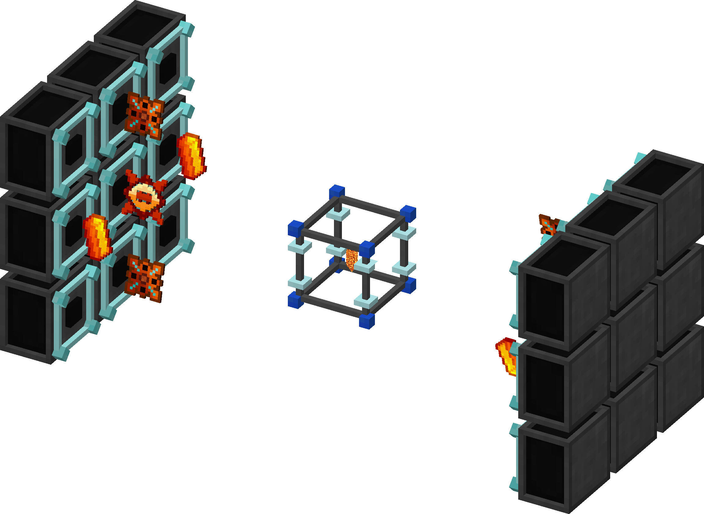
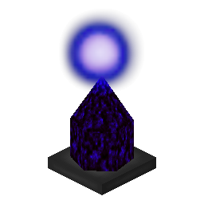
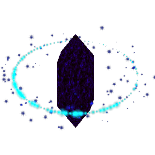
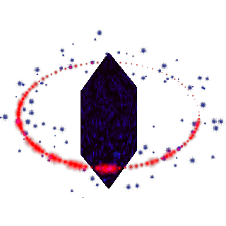

# Chaotic Energy Crystal

[![CurseForge Total Downloads][badge_curseforge]][curseforge]
&nbsp;&nbsp;&nbsp;&nbsp;&nbsp;&nbsp;&nbsp;&nbsp;[![Modrinth Total Downloads][badge_modrinth]][modrinth]

[badge_curseforge]: https://img.shields.io/badge/dynamic/json?url=https%3A%2F%2Fapi.cfwidget.com%2F1580867&query=downloads.total&style=for-the-badge&logo=curseforge&label=CurseForge&color=e04e14

[curseforge]: https://www.curseforge.com/minecraft/mc-mods/mekanism-more-machine

[badge_modrinth]: https://img.shields.io/modrinth/dt/A05mDLn7?color=5da545&label=Modrinth&style=for-the-badge&logo=modrinth

[modrinth]: https://modrinth.com/mod/chaotic-energy-crystal

Adds **Chaotic-tier energy crystals** for **Draconic Evolution**.

Find them in the DE Creative Tab → *Draconic Evolution Blocks*.

📦 **Dependencies:** [Draconic Evolution](https://www.curseforge.com/minecraft/mc-mods/draconic-evolution) (Required)

---

## Getting Started

- Uses **Fusion Crafting Core** to create
- View the exact recipe in **JEI**

> 💡 **Pro Tip:** Install [JEI](https://www.curseforge.com/minecraft/mc-mods/jei) to view the full recipes in-game.

<!-- Example paths:
  Same directory: ./fusion-crafting.png
  Subdirectory: ./assets/screenshots/fusion.png
-->

---

## Crystal Overview

### ⚡ Chaotic IO Crystal

| Property          |          Value |
|:------------------|---------------:|
| Max Charging Rate |  **256 MRF/t** |
| Max Link Range    | **256 Blocks** |
| Max Links         |          **5** |

---

### 🔁 Chaotic Relay Crystal

| Property          |          Value |
|:------------------|---------------:|
| Max Charging Rate |  **256 MRF/t** |
| Max Link Range    | **256 Blocks** |
| Max Links         |         **64** |

---

### 📡 Chaotic Wireless Crystal

| Property               |          Value |
|:-----------------------|---------------:|
| Max Charging Rate      |  **256 MRF/t** |
| Max Link Range         | **256 Blocks** |
| Max Links              |         **32** |
| **Max Wireless Links** |        **128** |

---

## Compatibility & Requirements

| Component              | Status / Version |
|:-----------------------|:-----------------|
| **Draconic Evolution** | ✅ Required       |
| **JEI / REI**          | ✅ Recommended    |
| **Minecraft**          | 1.21.1           |
| **Mod Loader**         | NeoForge         |